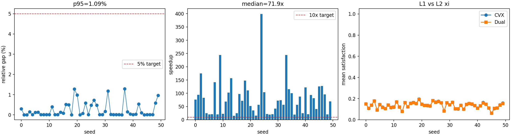
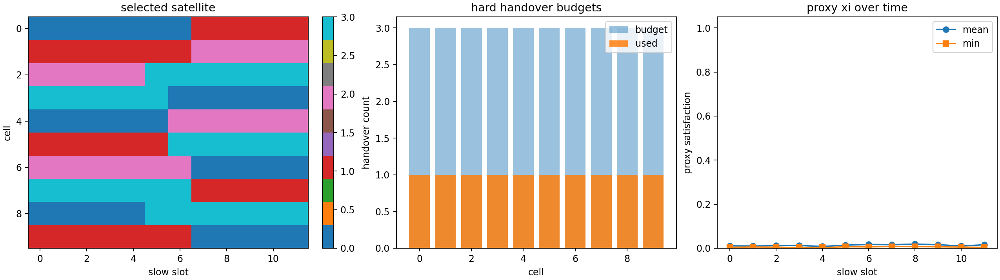

<div align="center">

# APEX

### Adaptive Policy with Embedded conveX optimization

Research code for dual-timescale fair downlink resource allocation in LEO
direct-access networks.

[](https://www.python.org/)
[](LICENSE)
[](pyproject.toml)
[](#roadmap)

</div>

APEX studies how to allocate scarce downlink PRBs and power across moving LEO
satellites and terrestrial cells when the system must balance three pressures:
fairness, limited handovers, and uncertain future demand.

The current codebase is organized around a staged optimization pipeline:

| Layer | Problem | Role | Current status |
|---|---|---|---|
| P1-L1 | Convex PRB-power allocation | Ground-truth resource allocation under fixed association | Implemented with CVXPY |
| P1-L2 | Dual decomposition | Fast approximation to the P1 convex benchmark | Implemented and benchmarked |
| P2-L1 | Offline association MILP | Satellite-cell association with hard per-cell handover budgets | Implemented with SciPy HiGHS |
| P2-L2 | Rolling-window decomposition | Medium-horizon association via repeated MILP subproblems | Implemented |
| P3 | Online hierarchical policy | Scheduling under demand uncertainty | Planned |

## Results Snapshot

<table>
  <tr>
    <td width="50%">
      <strong>P1: L1 CVX vs L2 dual benchmark</strong><br>
      Medium overloaded batch, 50 instances.
    </td>
    <td width="50%">
      <strong>P2: association with hard handover budgets</strong><br>
      Medium synthetic slow-timescale scenario.
    </td>
  </tr>
  <tr>
    <td>
      
    </td>
    <td>
      
    </td>
  </tr>
</table>

Latest committed benchmark summaries:

| Experiment | Key metrics |
|---|---:|
| P1 medium overloaded, 50 instances | median gap `3.76e-4`, p95 gap `1.09e-2`, median speedup `71.9x` |
| P2 toy, seed 0 | optimal, total handovers `5`, max per-cell handovers `1 / 2` |
| P2 medium, seed 0 | optimal, total handovers `10`, max per-cell handovers `1 / 3` |

## Quick Start

Create a local environment:

```bash
python3 -m venv .venv
.venv/bin/python -m pip install --upgrade pip
.venv/bin/python -m pip install -e ".[solvers,rl,dev,notebook]"
```

For local runs, activate the project helper so Matplotlib and font caches stay
inside the workspace:

```bash
source scripts/activate_env.sh
```

Commercial solvers are optional for bootstrapping but useful for paper-grade P1
baselines:

```bash
.venv/bin/python -m pip install -e ".[commercial-solvers]"
```

MOSEK and Gurobi require local licenses. The current P1 CVXPY kernel defaults to
MOSEK and falls back to open solvers where possible; the current P2 MILP path
uses SciPy HiGHS.

## Reproduce Current Runs

Run the P1 convex or dual toy experiment:

```bash
.venv/bin/python scripts/run_p1_experiments.py --scale toy --method cvx
.venv/bin/python scripts/run_p1_experiments.py --scale toy --method dual
```

Run the P1 L1-vs-L2 medium overloaded benchmark:

```bash
.venv/bin/python scripts/run_p1_benchmark.py --instances 50 --solver MOSEK
```

Run the P2 synthetic association experiment:

```bash
.venv/bin/python scripts/run_p2_experiments.py --scale toy --seed 0
.venv/bin/python scripts/run_p2_experiments.py --scale medium --seed 0
.venv/bin/python scripts/run_p2_experiments.py --scale medium --method rolling --window 5 --step 3
```

Run the generated-scenario P2 L1-vs-L2 benchmark:

```bash
.venv/bin/python scripts/run_p2_benchmark.py --scale stress --instances 3
```

Artifacts are written under `results/` as JSON summaries, compressed NumPy
arrays, and PNG diagnostics.

## Repository Map

```text
src/leo_alloc/
  solvers/
    p1_cvx.py      # L1 CVXPY convex allocation kernel
    p1_dual.py     # L2 dual decomposition approximation
    p2_milp.py     # P2 offline MILP association solver
    p2_rolling.py  # P2 rolling-window decomposition solver
  scenario/        # validated generated scenarios and channel/visibility models
  rl/              # P3 online policy components, planned
  utils/           # configuration and logging helpers

scripts/
  run_p1_experiments.py
  run_p1_benchmark.py
  run_p2_experiments.py
  run_p2_benchmark.py

doc/
  00_research_context.md
  01_system_architecture.md
  02_p1_kernel_spec.md
  03_p2_milp_spec.md
  04_p3_rl_spec.md
  05_experiment_design.md
```

## Development Checks

```bash
.venv/bin/python -m pytest -q
.venv/bin/python -m ruff check src tests scripts
.venv/bin/python -m ruff format --check src tests scripts/run_p1_experiments.py scripts/run_p1_benchmark.py scripts/run_p2_experiments.py scripts/run_p2_benchmark.py
.venv/bin/python -m mypy src/leo_alloc
```

The test suite currently covers P1 convex correctness, P1 dual behavior, P2 MILP
handover constraints, P2 rolling-window boundaries, and experiment-script smoke tests.

## Roadmap

- Benchmark P2-L1 vs P2-L2 across larger orbit-driven scenarios.
- Add P2-L3 large-scale heuristic and stronger baselines.
- Connect P2 labels to P3 imitation-learning data generation.
- Implement the online hierarchical RL policy and evaluate demand uncertainty.
- Produce paper-scale experiment tables and figures from reproducible scripts.

## Documentation

The design notes in [`doc/`](doc/README.md) describe the research context,
module specifications, experiment design, and coding conventions. Some early
documentation was written before the implementation existed; the root README is
the current operational entry point.
